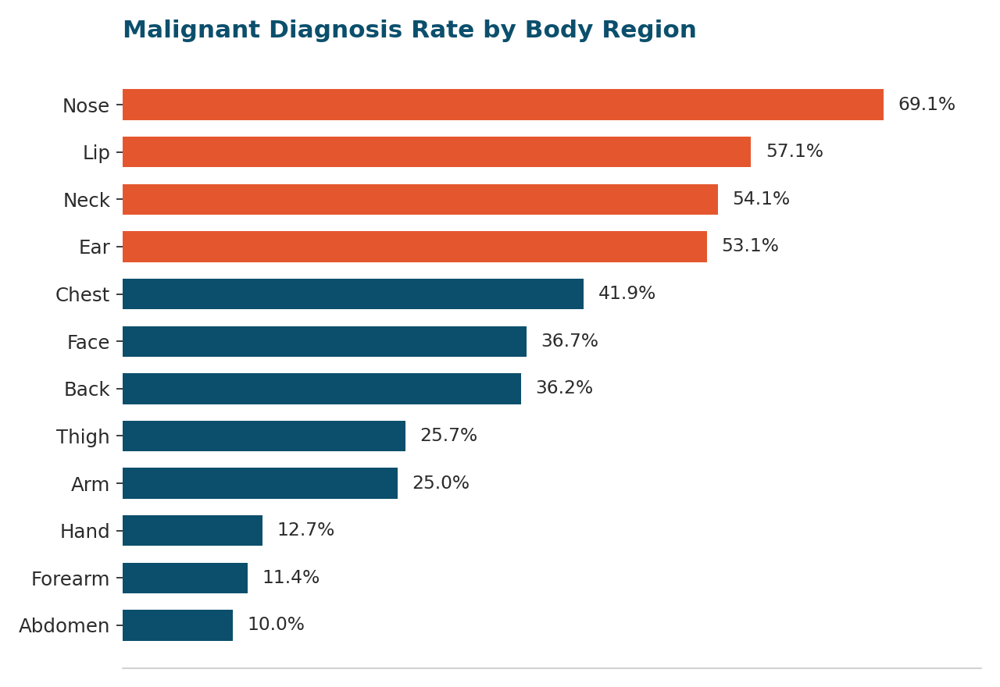
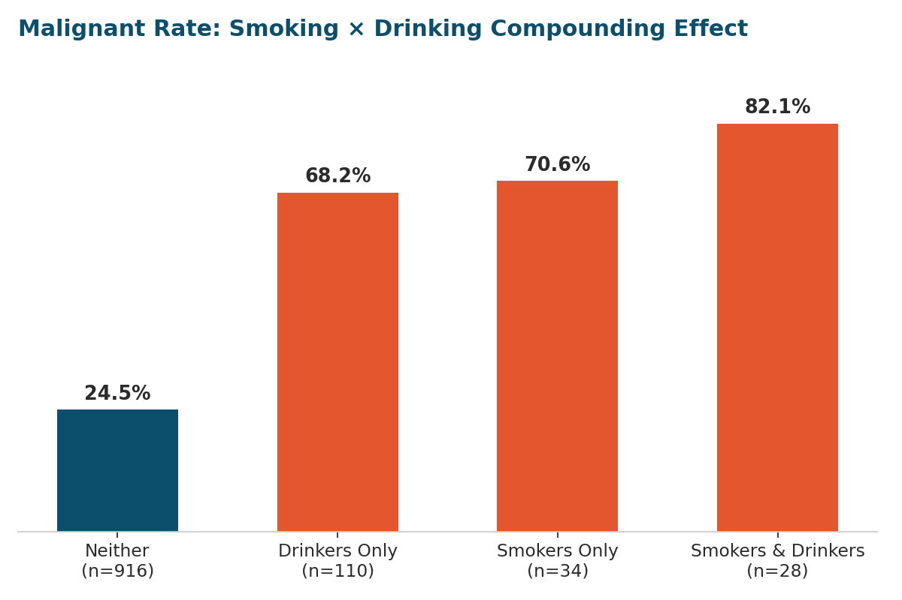
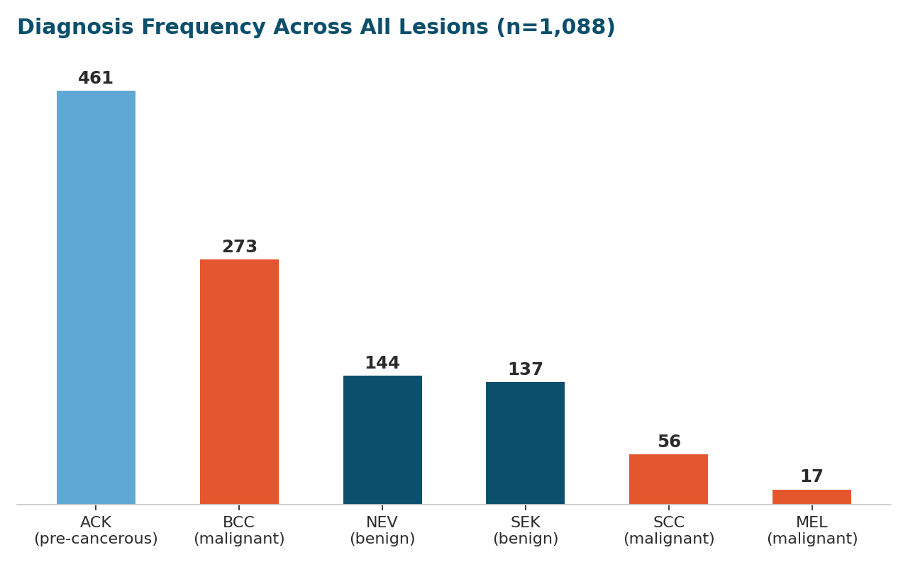

# 🔬 DORI Skin Cancer Analytics

**A PostgreSQL analysis of 1,088 diagnosed skin lesion records** — exploring patient demographics, lesion behavior, environmental context, and lifestyle risk factors using the [PAD-UFES-20](https://www.sciencedirect.com/science/article/pii/S2352340920312024) dermatology dataset.

Prepared for DORI (Dermalife Oncology & Research Institute) as a data analytics capstone project.

[](#)
[](#)
[](#)

---

## 📌 Why this project

Most "which region has the most cancer cases" analyses stop at raw counts. This project pushes past that — for example, the Face has the most malignant *cases* in the dataset, but the Nose has the highest malignant *rate*. Distinguishing volume from risk is the throughline of the whole analysis, and it's the difference between a stat that looks impressive and one that's actually useful for screening priorities.

## 🗂️ Dataset

- **Source:** PAD-UFES-20 — a public dermatology dataset of clinical skin lesion images and structured patient/lesion metadata.
- **Scope:** 1,088 diagnosed lesion records, spanning 6 diagnostic types (`ACK`, `BCC`, `NEV`, `SEK`, `SCC`, `MEL`), patient demographics, and environmental/lifestyle fields.
- **Tables:** `table1` (patient-level: age, gender, sanitation access, lifestyle habits) and `table2` (lesion-level: region, diagnosis, symptoms, diameter, biopsy status).

## 🛠️ Methodology

1. **Diagnostic categorization** — built a reusable SQL view classifying all 6 diagnostic codes into `Malignant` (MEL, SCC, BCC), `Pre-cancerous` (ACK), or `Benign` (SEK, NEV). Every downstream malignancy question builds on this one view.
2. **20 analytical questions** across four themes: patient demographics, lesion growth/behavior, environmental context, and lifestyle risk — see [`DORI_SKIN_CANCER_ANALYSIS.sql`](./DORI_SKIN_CANCER_ANALYSIS.sql) for the full query set.
3. **Techniques used:** `COUNT(*) FILTER (WHERE ...)`, `::numeric` casting for precision, `UNION ALL` for multi-metric comparisons, window functions (`SUM(...) OVER ()`), and multi-table joins across patient- and lesion-level grain.

```sql
-- The reusable classification view everything else builds on
CREATE VIEW lesion_with_category AS
SELECT
    *,
    CASE
        WHEN diagnostic IN ('MEL', 'SCC', 'BCC') THEN 'Malignant'
        WHEN diagnostic = 'ACK' THEN 'Pre-cancerous'
        WHEN diagnostic IN ('SEK', 'NEV') THEN 'Benign'
    END AS diagnostic_category
FROM table2;
```

## 📊 Key Findings

### 1. Volume isn't risk — region matters more by rate than by count

The Face has the most malignant diagnoses in raw count (102), but weighting malignant count against total cases per region tells a different story: the **Nose has the highest malignancy rate at 69.1%** — nearly double the Face's 36.7% — despite 4x fewer total cases.



```sql
SELECT
    region,
    COUNT(*) AS total_cases,
    COUNT(*) FILTER (WHERE diagnostic_category = 'Malignant') AS malignant_count,
    ROUND(100.0 * COUNT(*) FILTER (WHERE diagnostic_category = 'Malignant')
        / COUNT(*), 1) AS malignant_rate_pct
FROM lesion_with_category
GROUP BY region
ORDER BY malignant_rate_pct DESC;
```

### 2. Smoking + drinking compounds — sharply

Patients who both smoke and drink show an **82.1% malignant rate**, 3.4x the 24.5% baseline for patients with neither habit. Each factor alone (smoking, alcohol, pesticide exposure, family cancer history) runs close to 3x baseline — but combined smoking and drinking is the single strongest signal in the dataset.



### 3. Itching, not bleeding, is the dominant symptom

Across all lesions, **itch (62%)** and **elevation (56%)** were the most commonly reported symptoms — well ahead of bleeding (20%), pain (14%), or visible change (9%). 47% of lesions were actively growing at the time of record, and 42% were biopsied.



### 4. Diameter is a meaningful severity signal

Melanoma (MEL) lesions averaged **14.09mm** in diameter at diagnosis — over 5x the average size of benign nevus lesions (0.67mm) and nearly 2x benign keratosis (0.80mm). SCC and BCC (also malignant) averaged 10.46mm and 9.97mm.

### 5. A counterintuitive result — flagged, not published at face value

72% of patients lack piped water access and 75% lack sewage access. Cross-referencing sanitation status against malignancy rate produced a surprising result: patients with **adequate** sanitation showed a *higher* malignant rate (61.8%) than patients with **poor** sanitation (22.3%) — the opposite of a simple deprivation model.

> **This is very likely a detection-bias effect, not a biological one.** Patients with better infrastructure likely also have better healthcare access, so a larger share of their diagnoses get confirmed as malignant rather than missed. This finding is flagged rather than presented as a causal claim, and would need clinic-access data to validate before any external use.

## ⚠️ Limitations

- **Small lifestyle subgroups** — only 28 patients fall into the smoker+drinker group; rates from small groups swing more with individual cases.
- **Association, not causation** — no controls for age, sun exposure, or skin type across any of the lifestyle or environmental cuts.
- **Detection bias likely runs throughout** — patients who are diagnosed have already passed through some point of healthcare access, which shapes every cut of the data, not just the sanitation one.
- **Region counts mix lesion- and patient-level grain** — a patient with multiple lesions on the same region is counted multiple times.
- **Single-population dataset** — sourced from one regional population (Brazil); useful for internal analytics practice, not for global generalization.

## ✅ Recommendations

1. Prioritize **Nose and Lip** in screening — highest malignancy rate despite lower case volume.
2. Lead patient self-check education with **itch and elevation**, not just the commonly assumed "bleeding" red flag.
3. Target **combined smokers & drinkers** for focused counseling — the clearest actionable lifestyle signal in the data.
4. Validate the **sanitation finding** against clinic-access data before using it in any external communication.
5. Run an **age-adjusted follow-up analysis** — age likely confounds both the lifestyle and sanitation results.

## 📁 Repository contents

```
├── DORI_SKIN_CANCER_ANALYSIS.sql   # All 20 queries, organized by theme
├── assets/                          # Chart images used in this README
└── README.md
```

## 🧰 Tools

`PostgreSQL` · SQL (`FILTER`, window functions, views, joins) · `matplotlib` (visualization)

---

*Part of a broader data analytics portfolio spanning SQL, Power BI, and Excel capstone projects. Connect with me on [LinkedIn](#) or check out my other work.*
